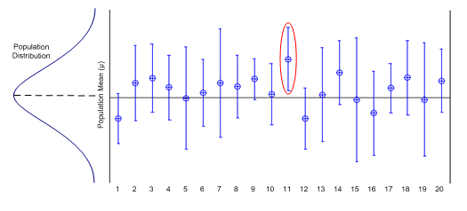

class: center, middle, invert
# Estimation and Confidence

```{r xaringan-themer, include=FALSE}
library(xaringanthemer)
solarized_light()
```

```{r, include = FALSE}
library(tidyverse)
library(lubridate)
```

```{r setup, include=FALSE}
knitr::opts_chunk$set(fig.height = 6, fig.width = 9)
```

---
# Setup

```{r}
library(modelr)
library(infer)
```

---
# Estimating the mean

Suppose we want to find the mean of a population, but we only have one sample, of size 100.

```{r, include = FALSE}
my_data <- data.frame(
  samples = rbeta(100, 1, 1))

```

```{r}
head(my_data)
```

---
# Estimating the mean

```{r}

my_data %>%
  summarize(mean(samples), sd(samples))
```

What do we think the true mean might be?  

How confident are we?

---
# Confidence

```{r}
my_test <- my_data %>%
  t_test(response = samples, mu = 0.5)

my_test
```

We are 95% confident that the true mean is between `r round(my_test$lower_ci, 3)` and `r round(my_test$upper_ci, 3)`.

---
# Confidence

... But what does this mean?

--




---
class: center, middle
# What assumptions did we rely on?

---
# The t distribution

```{r, echo = FALSE}
ggplot(, aes(x = -5:5)) + stat_function(fun = dt, args = list(df = 99), color = "darkred", size = 2) + xlab("t statistic")
```


---
# Our data

```{r}
ggplot(my_data, aes(x = samples)) + 
  geom_histogram(aes(y = ..density..), bins = 10, fill = "white", color = "black")+
  stat_density(fill = "cornflowerblue", alpha = 0.5)
```

---
class: center, middle
# The Central Limit Theorem!
## The sample mean is approximately Normal (t)
## As long as it's a mean of many (say > 15) samples.
---
# The problem of skew

```{r}
skewed_data <- data.frame(
  samples = rexp(1000)
)
```

```{r, echo = FALSE, warning = FALSE}
ggplot(skewed_data, aes(x = samples)) + 
  geom_histogram(aes(y = ..density..), bins = 100, fill = "cornflowerblue")
```

---
## Confidence

```{r}
my_test_2 <- skewed_data %>%
  t_test(response = samples)

my_test_2
```

---
class: center, middle
# Ask yourself...

Do you trust the t-confidence interval?

--

**YES!**  Central Limit Theorem!

--

* Is the mean the best measure of center?

--

**NO!**  The skew pulls the mean to the right.

--

* How would you make a confidence interval for the median?

--

Pull yourself up by your **bootstraps**!

---

background-image: url('bootstraps.png')

---
# Idea:

* A large enough representative sample from a population is a good approximation for the population.


```{r, echo = FALSE, warning = FALSE}
ggplot(skewed_data, aes(x = samples)) + 
  geom_histogram(aes(y = ..density..), bins = 100, fill = "cornflowerblue") +
  stat_function(fun = dexp, color = "darkred", size = 2)
```

---
# Idea

* If we had **many** samples, we could compute the median of each sample and see what happens.

* But: we only have one sample. :(

* Thus:  **Re-sample** from our sample!

---
# Bootstrap it:

*(Why `replace = TRUE`?)*

```{r}
skewed_data %>% 
  sample_n(1000, replace = TRUE)
```
---
# Bootstrap it:

```{r}
skewed_data %>% 
  sample_n(1000, replace = TRUE) %>%
  summarize(mean(samples))
```

```{r}
skewed_data %>% 
  sample_n(1000, replace = TRUE) %>%
  summarize(mean(samples))
```
---
class: center, middle, invert
# modelr
---
# Bootstrap it!

`resample_bootstrap` takes one new sample

--
... but the output object is complicated!

--

```{r}
one_boot <- skewed_data %>% resample_bootstrap()

str(one_boot)
```

---
# Bootstrap it!

`$idx` has the resampling indices

`$data` is a "pointer" to the original dataset.

```{r}
head(one_boot$data)
head(skewed_data)
```

---
# Bootstrap it!

If you want the actual shuffled dataset, you need to "coerce" it:

```{r}
data.frame(one_boot)
```

---
# Bootstrap it:

The `bootstrap` function takes many resamplings.

```{r}
my_boots <- skewed_data %>% bootstrap(100)
my_boots
```
---
# Let's plot it...

```{r, error = TRUE}
ggplot(my_boots, aes(x = strap)) + 
  geom_histogram(aes(y = ..density..), bins = 10, fill = "cornflowerblue")
```

---
# Calculate statistic first

```{r}
my_boots <- my_boots %>%
  mutate(
    boot_means = map_dbl(strap, ~mean(data.frame(.x)$samples)),
    boot_medians = map_dbl(strap, ~median(data.frame(.x)$samples))
  )

my_boots 
```

---
# THEN you can plot

```{r, echo = FALSE}
ggplot(my_boots, aes(x = boot_means)) + 
  geom_histogram(aes(y = ..density..), bins = 10, fill = "cornflowerblue")
```
---
# THEN you can plot

```{r, echo = FALSE}
ggplot(my_boots, aes(x = boot_medians)) + 
  geom_histogram(aes(y = ..density..), bins = 10, fill = "cornflowerblue")
```

---
# Bootstrapped confidence intervals

What range catches 95% of our bootstrap **mean** estimates?

```{r}

my_boots %>%
  pull(boot_means) %>%
  quantile(c(0.025, 0.975))

```

Recall the t-test confidence interval:

```{r}
my_test_2 %>% select(lower_ci, upper_ci)
```

---
# Bootstrapped confidence intervals

What range catches 95% of our bootstrap **median** estimates?

```{r}
my_boots %>%
  pull(boot_medians) %>%
  quantile(c(0.025, 0.975))

```
