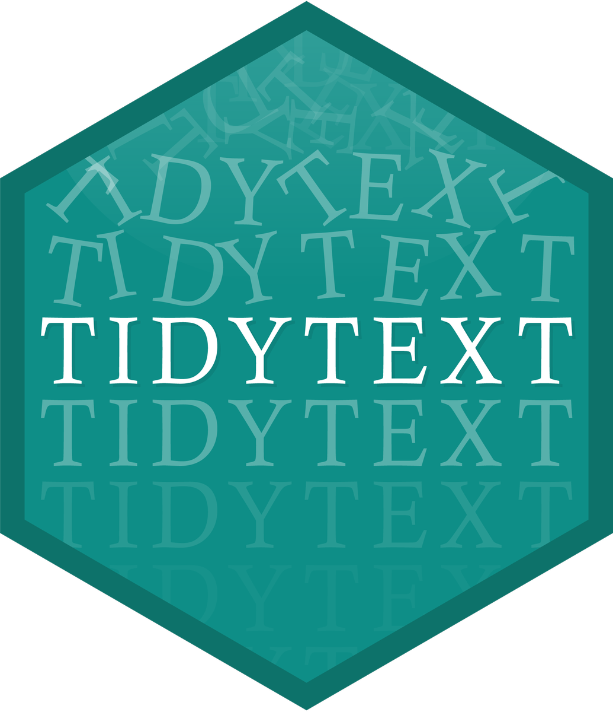

```{r setup, include=FALSE}
options(htmltools.dir.version = FALSE)
library(tidyverse)
```

```{r xaringan-themer, include=FALSE}
library(xaringanthemer)
solarized_light()
```

---
class: center, middle
# Regular Expressions

---
# Regular Expressions

A **regular expression** is a way of "fuzzy matching" text.

```{r}
my_str <- c("Kelly", "Jelly", "Belly", "Smelly", "Hi Kelly", "Kelly Bodwin")

str_extract(my_str, "Kelly")

```

--

```{r}

str_extract(my_str, ".elly")

```

--

```{r}

str_extract(my_str, "[A-z]+elly")

```

---
# Regular Expressions

* Letters and numbers match themselves

* `.` matches any character at all

* "escape" a special character with `\\` to match the literal character

---
# Regular Expressions

* `^` matches the start of the string

```{r}
str_subset(my_str, "^Kelly")
```

--

* `$` matches the end of the string

```{r}
str_subset(my_str, "Kelly$")
```

---
# Regular Expressions

* `{2}` means "the thing before me, exactly twice.

* `+` means "the thing before me, 1 to infinity times."

* `*` means "the thing before me, 0 to infinity times."


```{r}
my_str <- c("Key", "Kely", "Kelly", "Kellly", "Kelllllly")

```

--

```{r}
str_subset(my_str, "l{2}")
```

--

```{r}
str_subset(my_str, "l+")
```

--

```{r}
str_subset(my_str, "l*")
```

---

# Regular Expressions

* `[:alpha:]` or `[A-z]` matches any letter
* `[:punct:]` matches any punctuation
* (many more of these - see `stringr` cheatsheet!)
* `()` groups things together
* `[]` is "match any of these"

--

```{r}
my_str <- c("Kelly", "Kelkel")

str_subset(my_str, "([Kk]el){2}")
```

---
# Quick quiz

What will the following outputs be?

```{r, eval = FALSE}
my_str <- "The Dursleys of Number 4 Privet Drive were 
happy to say that they were perfectly 
normal, thank you very much."

str_extract_all(my_str, ".*")

str_extract_all(my_str, "\\w")

str_extract_all(my_str, "\\s")

str_extract_all(my_str, "[:alpha:]+")

str_extract_all(my_str, "[:alpha:]*\\.")

str_extract_all(my_str, "[wv]er[ey]")

```
---
# Harder quick quiz

What will the following outputs be?

```{r, eval = FALSE}
my_str <- "The Dursleys of Number 4 Privet Drive were 
happy to say that they were perfectly 
normal, thank you very much."

str_extract_all(my_str, "[:digit:] ([A-Z][a-z]*)+")

str_extract_all(my_str, "(?<=[:digit:] )[:alpha:]+")

str_extract_all(my_str, "[:digit:].*Drive")

my_str %>%
  str_split() %>%
  str_extract("^[A-Z]")
```

---

# Your Turn

The file `hamlet.txt` contains the text of the play "Hamlet" by Shakespeare.  Download this file and save it somewhere reasonable.  Read it into R as a string with:

```{r}
hamlet <- readLines("./hamlet_speech.txt")
```

---
# Your Turn

Answer the following:

* How many words are in the speech?  (Hint: `str_count`)
* How many times does Hamlet reference death or dying?
* How many sentences are in the speech?
* What is the longest word in the speech?
* What is the only capitalized word that does not start a sentence or line?

*Hint:* You may want to use `str_c()` for some of these, to make the vector into a single string.

---
class: center, middle

# Tokenizing



---

# Converting text to data

We need to separate text into words and/or n-grams.  These are called **tokens**.

The package `tokenizers` makes this much easier.

```{r}
library(tokenizers)

hamlet %>%
  str_c(collapse = " ") %>%
  tokenize_words()
```

---

```{r}
hamlet %>%
  str_c(collapse = " ") %>%
  tokenize_ngrams(3)
```

---

# Sentiment analysis

A popular approach to text analysis to to analyze *sentiments*, or how positive/negative certain language is.

```{r}
library(tidytext)

positive <- get_sentiments("bing") %>%
  filter(sentiment == "positive")

positive
```

---
# Sentiment analysis

```{r}
hdf <- hamlet %>%
  str_c(collapse = " ") %>%
  tokenize_words() %>%
  data.frame()

names(hdf) <- "word"

```

---
# Sentiment analysis

```{r}
hdf %>%
  semi_join(positive) %>%
  count(word, sort = TRUE)

```

---
# Try it

* What is are most common **negative** words in Hamlet's speech?

---
# Flex Points

* (10 flex points) The full text of the play is available as `hamlet.txt`.  Use this to make a plot of sentiment by Act of the play.  You may find [this book](https://www.tidytextmining.com/) helpful.

---